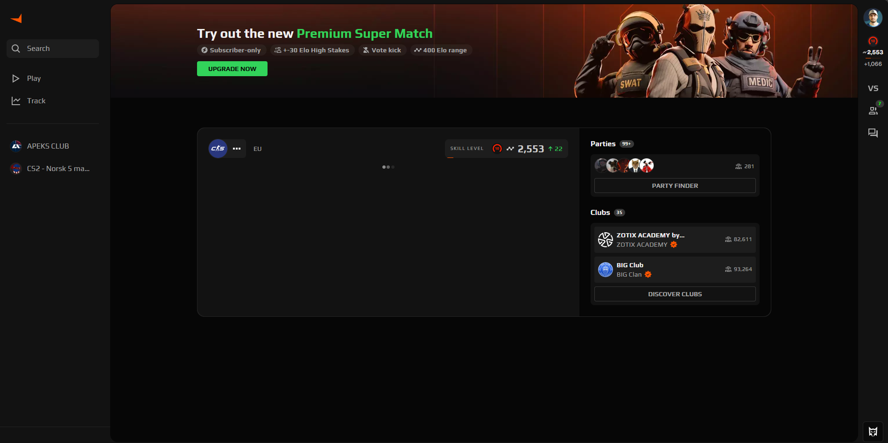

# Faceit UI Cleaner

A Chrome extension that helps you clean up the Faceit.com user interface by hiding unwanted elements.

## Features

The extension allows you to hide:

- **Feed Elements**: Removes distracting feed items, skill level widgets, monthly ladders, and missions widgets from your dashboard
- **Navigation Items**: Hides League and Tournament buttons, along with other navigation menu items
- **Party Bubble**: Removes the party bubble
- **Notifications Button**: Hides the notifications button

## Installation

### From Chrome Web Store

1. Visit [Faceit UI Cleaner on the Chrome Web Store](#)
2. Click "Add to Chrome"
3. Confirm by clicking "Add extension"

### Manual Installation (Developer Mode)

1. Download or clone this repository
2. Open Chrome and go to `chrome://extensions/`
3. Enable "Developer mode" in the top right
4. Click "Load unpacked" and select the extension folder
5. The extension will now appear in your browser toolbar

## Usage

1. Navigate to [Faceit.com](https://www.faceit.com/)
2. Click the Faceit UI Cleaner icon in your browser toolbar
3. Use the toggle switches to hide/show different UI elements:
   - **Hide Feed Elements**: Toggle off to show feed, monthly ladders, skill level, and missions
   - **Hide Nav Items**: Toggle off to show League/Tournament buttons and navigation items
   - **Hide Party Bubble**: Toggle off to show the party invite bubble
   - **Hide Notifications Button**: Toggle off to show the notifications button
4. Changes are applied immediately and your preferences are saved

## Troubleshooting

- **Extension not working**: Make sure you're on the Faceit.com website
- **Elements still visible after toggling**: Try refreshing the page
- **Error messages**: If you see an error, refresh the page or reload the extension

## Privacy

Faceit UI Cleaner is fully client-side and does not collect or transmit any data. All preferences are stored locally in your browser.

## License

MIT License 